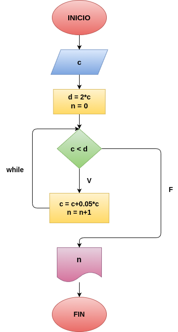

# Interes_compuesto
meses en que se duplica el capital

## Análisis

### Variable de entrada
- c: capital

### Proceso

d = 2*c

n = 0

while c < d:

    c = c * 1.05
    n = n + 1

## Diseño

## Contrucción
- odigo implementado en el archivo "Interes_compuesto"